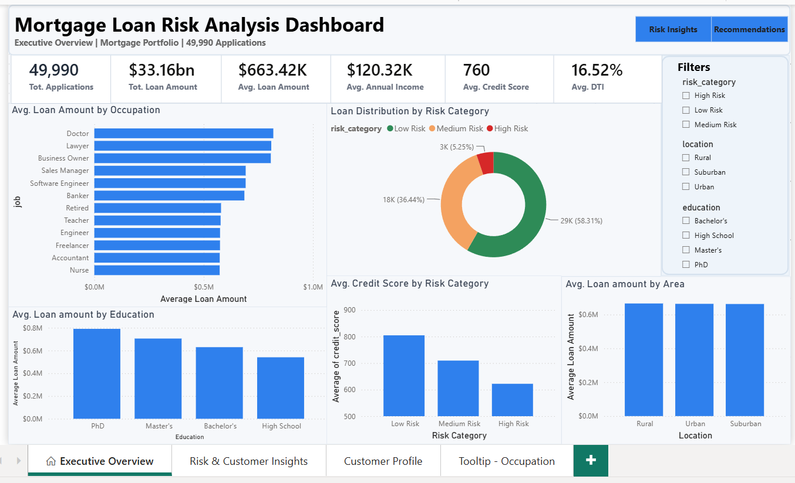
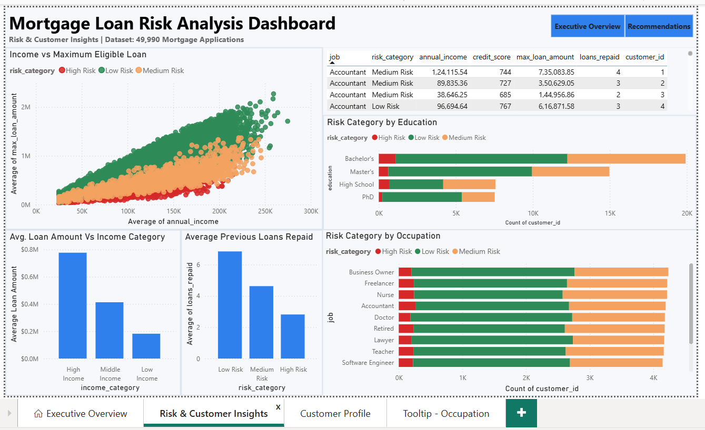
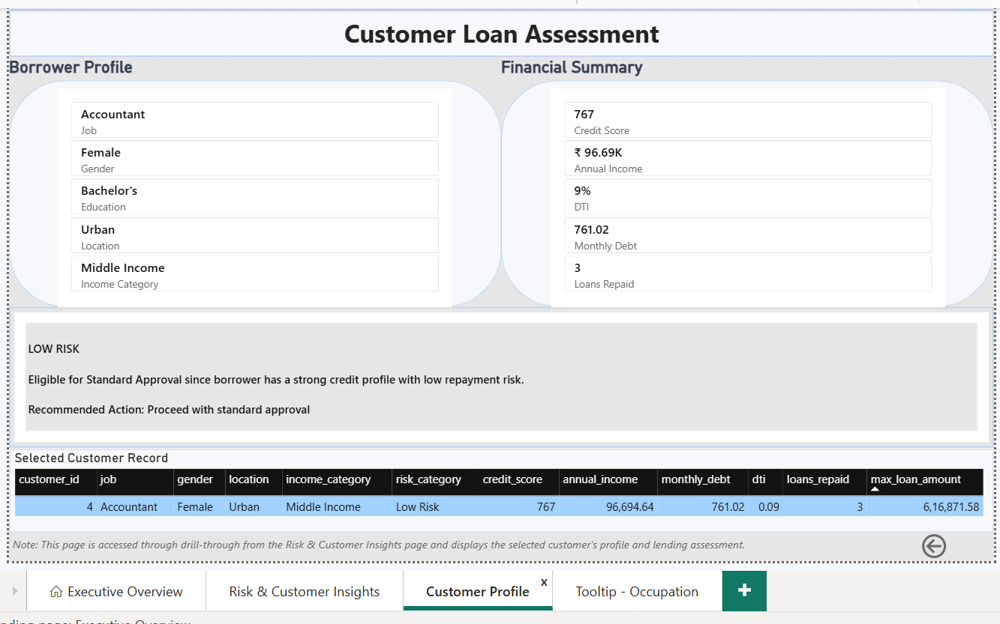

# Mortgage Loan Risk Analysis Dashboard

## Project Overview

This Power BI dashboard analyzes approximately 50,000 mortgage loan applications to identify lending risk, borrower characteristics, and portfolio performance. The report was designed to support data-driven lending decisions through interactive visualizations, drill-through analysis, and dynamic insights.

## Business Objectives

This dashboard answers the following business questions:

1. Which occupations receive the highest average loan amounts?
2. How are borrowers distributed across risk categories?
3. Does education influence maximum eligible loan amounts?
4. How do credit scores vary across different risk categories?
5. Which borrower profiles have the strongest repayment history?
6. How do customer demographics influence lending behavior?

## Dashboard Pages

### Executive Overview
- Portfolio KPIs
- Risk distribution
- Occupation analysis
- Education analysis
- Area analysis
- Interactive slicers

### Risk & Customer Insights
- Income vs Maximum Loan Eligibility
- Risk by Occupation
- Risk by Education
- Loan Repayment Analysis
- Interactive borrower table
- Dynamic tooltips
- Drill-through navigation

### Customer Profile
- Borrower profile
- Financial summary
- Dynamic risk assessment
- Detailed customer information

## Features

- Interactive dashboard navigation
- Dynamic DAX measures
- Drill-through customer profiles
- Dynamic tooltips
- Cross-filtering visuals
- Executive KPI cards
- Business-focused dashboard design

## Tools & Technologies

- Microsoft Power BI
- Power Query
- DAX
- Data Modeling

## Skills Demonstrated

- Dashboard Design
- Data Visualization
- Business Intelligence
- DAX Development
- Data Modeling
- Interactive Reporting
- Data Storytelling

## Dataset

Mortgage Loan Applications

Approximately 49,990 borrower records containing:
- Annual Income
- Credit Score
- Occupation
- Education
- Monthly Debt
- Debt-to-Income Ratio
- Risk Category
- Maximum Loan Amount
- Loan Repayment History

## Dashboard Preview

### Executive Overview

### Risk & Customer Insights

### Customer Profile

## Key Insights

- Low-risk borrowers consistently have the highest average credit scores.
- Doctors and Lawyers qualify for the highest average loan amounts.
- Higher education levels generally correlate with larger loan eligibility.
- High-risk borrowers demonstrate weaker repayment histories.
- Borrower occupation and demographics significantly influence lending patterns.

## Author
**Reseka**
Aspiring Data Analyst | Power BI | SQL | Excel | Python
